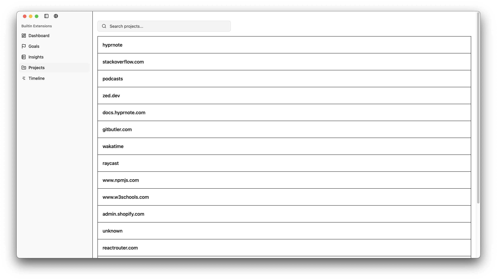

# Skopio Desktop

Skopio Desktop is the native cross-platform client of the [Skopio](https://github.com/Skopio-app/skopio) productivity and coding time-tracking ecosytem.

It provides a lightweight, privacy-first interface for collecting, visualizing, and syncing app usage, coding activity, AFK detection, and goal-tracking — all running locally on your machine.

---

## Features

- **App usage tracking** - Capture active windows, apps, and their durations of use.
- **Coding Activity** - Detect files, projects, languages, and editor events (Xcode).
- **Goals & Notifications** - Define usage goals (per app, category) with desktop notifications.
- **Dashboard** - Visualize activity timelines, categories, and insights with charts.
- **Local-First** - All data is stored in a local SQLite database.

## Getting Started

- [Rust](https://www.rust-lang.org/)
- [Node.js](https://nodejs.org/en)
- [Yarn](https://yarnpkg.com/) (preferred package manager)

### Installation (Development)

Clone the monorepo and install dependencies:

```bash
yarn install
```

Run the desktop app in development mode:

```bash
yarn workspace @skopio/desktop tauri dev
```

## Releases

Official builds are published to the [desktop-releases](https://github.com/Skopio-app/desktop-releases) repository.

## Screenshots

| Dashboard                                     | Goals                                 |
| --------------------------------------------- | ------------------------------------- |
|  |  |

| Projects                                    | Project Details                                           |
| ------------------------------------------- | --------------------------------------------------------- |
|  |  |

| Timeline                                    |     |
| ------------------------------------------- | --- |
|  |     |
